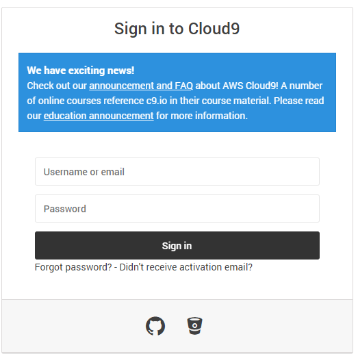
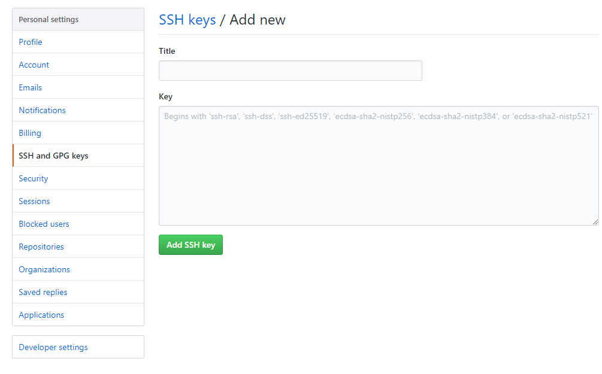
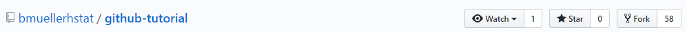

# 🔥GitHub Tutorial🔥


#### _By ***dorwinl3894***_ 

---
## Git vs. GitHub 🌍

**Git** - a version control system software that is used to collaborate
with other people and track changes in your code. This program is used primarily to
track your code in Github, but Git can be used without Github, such as in your 
computer.  
  
  You can access the Git terminal by

**Github** - A website developed by Github Inc. that can be used to...   
* Store your code
* Share your code with other people
* Contribute to other people's code
* Learn from other programmers

 ***Q:***  So what's the difference between Git and Github?  
 ***A:***  Git is a software tool used to control versions of your code and Github is a service website that helps you store the code in a repository.

---
## Initial Setup 🌈
#### Setting up Github
1. [Go to Github.com](https://github.com/)
2. Press "sign up for Github"
3. Enter your info
4. Press "create an account"


##### Congratulations! Now you have a Github account. 🔥

#### Setting up a Cloud9 workspace
1. [Go to c9.io/login](https://c9.io/login)
2. In the bottom, you should see a logo of Github.  
  
3. Enter your Github information.  
4. Now you should see a section that says "Create a New Workspace" with a plus sign in the middle.  
5. Set up your new workspace; The template should be "Blank"
6. Press "Create Workspace"

##### Congratulations! You now have a workspace in Cloud9 to program in. 🔥


#### Setting up an SSH key between Github and Cloud9  
1. [Go to github.com](https://github.com)
2. Click on your profile logo
3. Go to settings
4. Under "Personal Settings", click on "SSH and GPG keys"
5. Click on "New SSH Key"
6. Name it whatever you want; preferably "Cloud9"  
  
7. ***DO NOT*** Click "Add New SSH Key"
5. [Go back to Cloud9](https://c9.io/)
6. In the top right corner, there is a gear icon, click that
7. Go to "SSH Keys"
8. Copy the whole "Connect to your private git repository" key
9. Go back to your Github tab
10. Copy the key where it says "key"
11. Now press "Add SSH key"
12. Go back to Cloud9 and go inside your workspace
13. If you do not see a console , go to "View" and click on "Console F6"
14. Type in "ssh -T git@github.com" into the command line

##### Congratulations! You just connected Cloud9 and Github. 🔥

---
## Repository Setup 🔅
Now that you have a workspace and a SSH connection between Github and Cloud9, lets make your first repository.
1. Be in the command line

2. type in `cd ~/workspace` . `cd` stands for "change directory". So when you type in `cd ~/workspace` you are changing the directory that you are on, to the workspace which is just the primary directory wher you will put all of your other directories into.

3. Now type in `mkdir first-repo` . `mkdir` stands for "make directory" and if you can't tell, it makes a directory. Whatever we type after `mkdir` is a name. So in our case, `first-repo` is the name of the new directory we just made.

4. Next `cd` into your newly made repository by typing in `cd first-repo`. 

5. Finally type in `git init` . This command is from Git, and allows you to initialize Git into your repository so that you can use git commands in your directory.

***Q:*** Oops, I accidently `git init` in the wrong directory! How do I remove Git from the repo?  
***A:*** type in `rm -rf .git` in the directory that you accidently put Git in.

***Q:*** I hate this repository. How do i remove it?  
***A:*** First type in `cd ~/workspace` then type in `rm-rf <repo-name>`

***Q:*** How do I remove a repository from my Github?  
***A:*** go to [github.com](https://github.com) , click inside your repository, then go to settings, scroll down to "Danger zone" and click "Delete this repository".
##### Congratulations! You now have a directory with Git inside. 🔥

#### Making a file in Cloud9 
In every directory, there should be a README.md file, so that's what you will be making
1. type in `touch README.md` in the command line. `touch` means to make a new file that you can type your code in. `README.md` is the file name. 
2. Open your first-repo directory and go into the README.md file.
3. Type in whatever you want; could be "woigjmwaogw" or "Hello World!"
4. type in ctrl + S to save your file
5. Go back to the command line and type in `git add README.md`. This adds the file to the staging area to be sent to Github. 
6. Now type in `git commit -m "Create README file"`. `git commit -m` is a Git command to commit the changes that you made in the file. The text in the quoation marks has to be related to what you changed. 
7. [Go back to github.com](https://github.com)
8. Click on the plus icon 
9. Press "New Repository".
10. Name the repository into the ***same exact name*** as your directory. In this case, it is "first-repo".
11. Press "Create Repository". 
12. Under the section "...or push an existing repository from the command line" , copy the `git remote add origin` command into your command line and press enter. Then copy and paste the `git push -u origin master` into your command line. These two commands create a connection between your new directory on Github and Cloud9 and pushes your file into your Github repository.

***Q:*** How do I know that I did this correct and my directory is actually connected to my Github directory?  
***A:*** type in `git remote -v` into the command line. You should see `origin git@github.com:username/filename.git`. If you don't type in `git remote rm origin` to delete the connection and try the steps again.

##### Congratulations! You now know how to make a file and connect it to Github. 🔥

---
## Workflow & Commands 🌊
***Q:*** Cool! Can I have a list of Git commands that will help me?  
***A:*** Yes  
* `git status` - checks to see if there are any modified files in the directory that you ar currently on. If there are modified files, the file will show in red. If not, you are good to go.
* `git add <filename>` -  this adds a file to the "staging area" to be commited and pushed to your Github repository. 
* `git commit -m <message>` - this commits your file. In simple terms, it takes a snapshot of your code so that you can go back to it , or it can be used as a checkpoint for your progress.
* `git push` - this pushes the file you are currently at to Github. When you type in `git push` you can then see your new file on Github and check your commmits. 
* `git log` - gives a list of your commits. 

---
## Rolling Back Changes ◀️
***Q:*** How do I undo an edit?  
***A:*** `git checkout -- <filename>`

***Q:*** I typed in `git add <filename>` and now I don't want it to be added to the staging area. Help!  
***A:*** `git reset HEAD <filename>` 

***Q:***  I typed in `git commit` and I don't need to commit yet. How do i revert this?  
***A:*** `git reset HEAD~1` removes your commit and file from the staging area.

***Q:*** How do I rollback my file that I pushed to Github?  
***A:*** `git push -f origin <filename>` This will remove your last pushed commit entirely.

---
## Collaborating with others 💑
>"Collaboration is the key to success" - dorwinl3894 🚪🏆


#### `git clone` 
* This command will clone someones repository into your local workspace. You can not `git push` it into your github.
1. Go to someones repository via github.com
2. Choose a repository that you want to clone
3. Press the green button that says "Clone or download" 
4. copy and paste the link
5. Go to your workspace
6. type in `cd ~/workspace`
7. On the command line, type in `git clone <https-link-to-someones-repository>`  

##### Congrats! You now have someone elses repository in your local workspace! 🔥

#### Forking
* Forking makes a remote copy of their remote repository so that you can work on it ***and*** push it to your Github.

1. Go to a user's repository that you want to work on.
2. On the top right of their repository, there is a "fork" button. Click it  

3. Now click on "Clone or download"  
  
4. copy and paste the link
5. type in `git clone <https-link-to-someones-repository>` in the command line.
6. Work on the repository
7. `git add` , then `git commit -m` and `git push`. 

##### Congrats! You now have a Github repository of someone elses repository!

#### pull request
* This is used to request a change to someone elses repository so that they can add it to their original repository
1. Go to someones repository.
2. Click on the third tab "Pull Requests"  
  
3. Click on "New Pull Requests"  
  
4. Press "Create pull requests"

##### Congrats! Now you have submitted your code and it is up to the user whether they want to use that code or not. 🔥

---
```javascript
class Reader extends Human {
  constructor(you) {
    super(you);
    this.rating = null;
  }
  
  setRating(rating) {
    this.rating = rating;
    return this.rating;
  }
}
  
const user = new Reader();
  
if (user.rating instanceof Number && user.rating >= 5) {
  console.log(`${"⭐".repeat(user.rating)} Thanks for reading!`);
} else {
  console.log("💩");
}
```
<div style="text-align:center"></div>